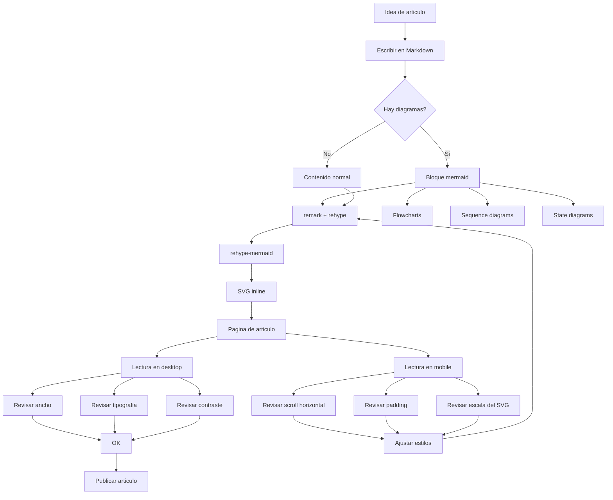

# Título principal

Este artículo existe para revisar cómo se ven los elementos más comunes de un Markdown normal en la página de artículos.

Incluye **texto en negrita**, *texto en cursiva*, `inline code`, y un [link externo a Astro](https://astro.build).

## Párrafos y saltos de línea

Este es un párrafo normal con una longitud suficiente para revisar ritmo de lectura, ancho de columna y espaciado entre líneas.

Esta línea está separada por un salto simple
y debería respetar el comportamiento configurado para breaks.

## Listas

- Primer ítem de lista.
- Segundo ítem con más texto para revisar el wrapping cuando la línea se extiende un poco más de lo habitual.
- Tercer ítem con `inline code`.

1. Primer paso.
2. Segundo paso.
3. Tercer paso.

## Task list

- [x] Markdown parseado.
- [x] Estilos base aplicados.
- [ ] Revisar en mobile.

## Cita

> Una cita simple sirve para revisar jerarquía visual, margen y contraste sin perder el tono minimalista.

## Separador

---

## Tabla

| Elemento | Estado | Nota |
| --- | --- | --- |
| Encabezados | OK | Mantienen jerarquía clara |
| Listas | OK | Buen espaciado entre ítems |
| Bloques de código | OK | Fondo oscuro y highlight |

## Código

```ts
type ArticlePreview = {
  title: string;
  readingTimeMinutes: number;
};

export const formatLabel = (article: ArticlePreview) => {
  return `${article.title} · ${article.readingTimeMinutes} min`;
};
```

```bash
pnpm dev
pnpm build
```

```ts
import type { APIRoute } from "astro";

type Env = {
  DB: D1Database;
};

type Article = {
  id: number;
  slug: string;
  title: string;
  content: string;
  published_at: string | null;
};

export const GET: APIRoute<never, never, Env> = async ({ params, locals }) => {
  const { slug } = params;

  if (!slug) {
    return new Response(JSON.stringify({ error: "Missing slug" }), {
      status: 400,
      headers: { "Content-Type": "application/json" },
    });
  }

  const result = await locals.DB.prepare(
    "SELECT id, slug, title, content, published_at FROM articles WHERE slug = ?1 LIMIT 1",
  )
    .bind(slug)
    .first<Article>();

  if (!result) {
    return new Response(JSON.stringify({ error: "Not found" }), {
      status: 404,
      headers: { "Content-Type": "application/json" },
    });
  }

  return new Response(JSON.stringify(result), {
    status: 200,
    headers: { "Content-Type": "application/json" },
  });
};
```

## Mermaid



## Subtítulo nivel 3

### Un nivel más abajo

Otro párrafo para ver cómo conviven encabezados secundarios con texto corrido, enlaces como [Convex](https://convex.dev) y algo de énfasis en **palabras clave**.

## Cierre

Si esta página se ve bien, el render base de Markdown ya cubre bastante bien un artículo editorial normal.
